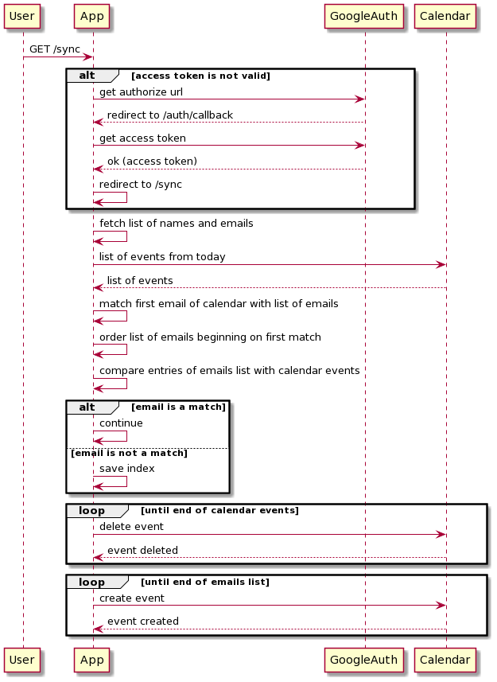

## GOOGLE CALENDAR SCRIPT

This script was created to fulfill the need of syncing multiple recurring events for different attendees, at once, on Google Calendar.
In this particular case, this was necessary to update an event, that happens every Wednesday, but with different people on it and different event's name.

### GUIDE TO USE THIS SCRIPT

This is a step-by-step guide to use this script:

1. In this project, ngrok is used as the way to expose your local server. So, you need to download ngrok and run it on your machine, providing it the port of the network service. In this case, the port is 3000  (e.g. `./ngrok http 3000`).

2. You need to have a client ID and a client secret for your Google account. You just need to create the OAuth 2.0 credentials on the Google Cloud Platform > Credentials. The URI will be `https://<ngrok_id>.ngrok.io/auth/callback` (<ngrok_id> is the ID you will find in your terminal when you run ngrok, which means you may have to change it every time you run an new instance of ngrok).

3. With the client ID, client secret and <ngrok_id>, you just need to go to the [authentication file](./src/gateways/authentication.client.js) and insert them in the correct variables.

4. You will need to have a list of names and emails separated by a comma (you can export a Google Sheet in csv format). You can see an example [here](./src/qa_data.csv).

5. Finally, you just need to have the ID of the calendar you want to update. Just go to the settings of the calendar, and you will find the Calendar ID there. Then, you just need to go to the [sync calendar interactor](./src/interactors/sync.calendar.js) and place this information in the `calendarId` variable.

6. And you're good to go! Just run `yarn start` on your terminal and open a browser tab with this endpoint: `https://<ngrok_id>.ngrok.io/sync`. The magic will happen!
